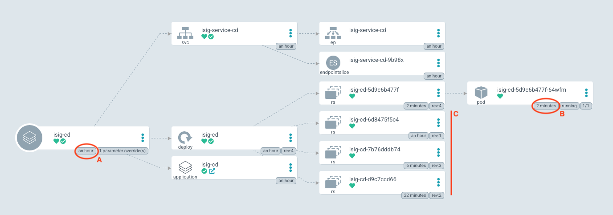

# Kontinuerlig produksjonssetting

## Argo CD Image Updater

Nå skal vi lage et opplegg hvor vi produksjonssetter kontinuerlig, altså for hver enkelt endring som kommer inn på `master`-greina. For å få til dette må vi først installere en komponent i Argo CD som kan reagere på endringer i et *Docker Container Registry*; [Argo CD Image Updater](https://argocd-image-updater.readthedocs.io/en/latest/install/start/).


```shell
kubectl apply -n argocd -f \
  https://raw.githubusercontent.com/argoproj-labs/argocd-image-updater/stable/manifests/install.yaml
```

Kjører du `kubectl get pods -n argocd` skal du nå se at den nye podden er oppe og kjører.

### Autentisering mod Argo CD

For at denne skal få kontakt med Argo CD API'et må vi gi den tilgang. Først må vi redigere konfigurasjonen til Argo CD. Denne finner vi inne i Kubernetes så da må vi bruke `kubectl`:

```shell
kubectl edit configmap argocd-cm -n argocd
```
Kjør koden ovenfor og legg til følgende:

```yaml
data:
  accounts.image-updater: apiKey
```

Nå må vi generere et token som vi kan benytte senere. Vi tar vare på verdien i `$ARGOCD_TOKEN`.

```shell
ARGOCD_TOKEN=$(argocd account generate-token --account image-updater --id image-updater)
```

Nå har vi laget en brukerkonto og hentet ut et token som kan brukes til autentisering, nå må vi gi denne brukerkontoen tilgang (*rbac* er en mye brukt forkortelse for *Role Based Access Control*):

```shell
kubectl edit configmap argocd-rbac-cm -n argocd
```

Kjør kommandoen ovenfor og legg til følgende:

```yaml
data:
  policy.csv: |
    p, role:image-updater, applications, get, */*, allow
    p, role:image-updater, applications, update, */*, allow
    g, image-updater, role:image-updater

```
Neste jobb er å lage en "secret" ut av det tokenet vi hentet ut tidligere slik at *Argo CD Image Updater* kan benytte seg av dette.

```shell
kubectl create secret generic argocd-image-updater-secret \
  --from-literal argocd.token=$ARGOCD_TOKEN --dry-run=client -o yaml |
  kubectl -n argocd apply -f -
kubectl -n argocd rollout restart deployment argocd-image-updater
```

## Instansiering av applikasjonen

Nå er vi klare til å opprette en ny instans av applikasjonen. Denne vil på grunn av den konfigurasjonen vi har gjort tidligere automatisk oppdatere applikasjonen hver gang det kommer et nytt image i ghcr.

```
argocd app create isig-cd --repo https://github.com/itema-as/gitops-in-practice \
  --path isig-argocd --dest-server https://kubernetes.default.svc \
  --dest-namespace
argocd app sync isig-cd
```

Legg merke til at vi brukte `--path isig-argocd` her. Denne peker på annen Kubernetes-konfigurasjon enn den vi brukte tidligere. Hovedforskjellen finnes i `isig-application.yml`

```yaml
apiVersion: argoproj.io/v1alpha1
kind: Application
metadata:
  annotations:
    argocd-image-updater.argoproj.io/image-list: cd=ghcr.io/itema-as/isig:master
    argocd-image-updater.argoproj.io/cd.update-strategy: digest
  name: isig
  namespace: argocd
spec:
  destination:
    namespace: default
    server: https://kubernetes.default.svc
  project: default
  source:
    path: isig-cd
    repoURL: https://github.com/itema-as/gitops-in-practice.git
    targetRevision: HEAD
  syncPolicy:
    automated:
      prune: true
      allowEmpty: true
      selfHeal: true
```
Legg merke til `cd.update-strategy: digest`. Det er denne parameteren som forteller Argo CD at den skal hente ut gjeldende versjon av den taggen oppgitt i `image-list`.

Så snart det er publisert nye versjoner av en applikasjon på **master**-greina vil man kunne se dette i Argo CD. Den nye pod'en dukker opp og hvis den starter opp OK (**B**), vil den gamle fjernes. I tillegg vil man kunne se at det dukker opp _replica set_ for hver av de gamle konfigurasjonene (**C**). Sammenligner man med når applikasjonen ble opprettet (**A**) ser man raskt at det har kommet nye versjoner.



