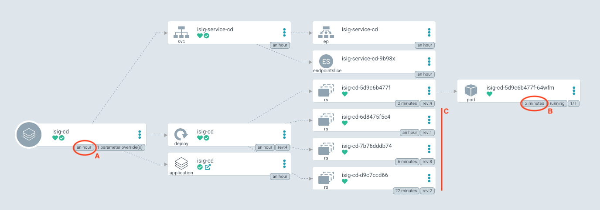

# Kontinuerlig produksjonssetting med Argo CD

## Installere Argo CD Image Updater

Nå skal vi lage et opplegg hvor vi produksjonssetter kontinuerlig, altså for hver enkelt endring som kommer inn på `master`-greina til *iSig*, eller strengt tatt for hver gang et nytt *image* bygget fra denne greina. Siden Argo CD normalt vil kun oppdatere en applikasjon om der er endringer i Git-repoet som deklarasjonen til applikasjonen ligger – må vi først legge til en ny tjeneste som kan reagere på endringer i et *Docker Container Registry* og fortelle Argo CD at den må oppdatere; [Argo CD Image Updater](https://argocd-image-updater.readthedocs.io/en/latest/install/start/).

```shell
kubectl apply -n argocd -f \
  https://raw.githubusercontent.com/argoproj-labs/argocd-image-updater/stable/manifests/install.yaml
```

Kjører du `kubectl get pods -n argocd` skal du nå se at den nye podden er oppe og kjører.

### Autentisering mot Argo CD

For at *Image Updater* skal få kontakt med Argo CD API'et må vi gi den tilgang. Først må vi redigere konfigurasjonen til Argo CD. Denne finner vi inne i Kubernetes så da bruker vi `kubectl`:

```shell
kubectl edit configmap argocd-cm -n argocd
```
Kjør kommandoen ovenfor og legg til følgende snutt nederst i tjenestens *config map*:

```yaml
data:
  accounts.image-updater: apiKey
```

Nå må vi generere et token som vi kan benytte senere. Vi tar vare på verdien i `$ARGOCD_TOKEN`.

```shell
ARGOCD_TOKEN=$(argocd account generate-token --account image-updater --id image-updater)
```

Da har vi laget en brukerkonto og hentet ut et token som kan brukes til autentisering, nå må vi gi denne brukerkontoen tilgang til API'et (*rbac* er en mye brukt forkortelse for *Role Based Access Control*):

```shell
kubectl edit configmap argocd-rbac-cm -n argocd
```

Kjør kommandoen ovenfor og legg til følgende nederst i filen:

```yaml
data:
  policy.csv: |
    p, role:image-updater, applications, get, */*, allow
    p, role:image-updater, applications, update, */*, allow
    g, image-updater, role:image-updater

```
Neste jobb er å lage en *secret* ut av det tokenet vi hentet ut tidligere slik at *Argo CD Image Updater* kan benytte seg av dette. Etterpå starter vi tjenesten på nytt slik at den får med seg endringene.

```shell
kubectl create secret generic argocd-image-updater-secret \
  --from-literal argocd.token=$ARGOCD_TOKEN --dry-run=client -o yaml \
  | kubectl -n argocd apply -f -
kubectl -n argocd rollout restart deployment argocd-image-updater
```

## Kontinuerlig produksjonssetting av iSig

Nå er vi klare til å opprette en ny instans av iSig. Dette vil i motsetning til den første vi laget  automatisk oppdatere instansen hver gang det kommer et nytt image i *GitHub Container Registry*.

```
argocd app create isig-cd --repo https://github.com/itema-as/gitops-in-practice \
  --path argocd-applications/isig/develop --dest-server https://kubernetes.default.svc \
  --dest-namespace default
argocd app sync isig-cd
```

Legg merke til at vi brukte `--path argocd-applications/isig/develop` her. Denne peker på annen Kubernetes-konfigurasjon enn den vi brukte tidligere. Hovedforskjellen finnes i `application.yml` som vist nedenfor.

```yaml
apiVersion: argoproj.io/v1alpha1
kind: Application
metadata:
  annotations:
    argocd-image-updater.argoproj.io/image-list: cd=ghcr.io/itema-as/isig:master
    argocd-image-updater.argoproj.io/cd.update-strategy: digest
  name: isig
  namespace: argocd
spec:
  destination:
    namespace: default
    server: https://kubernetes.default.svc
  project: default
  source:
    path: isig-cd
    repoURL: https://github.com/itema-as/gitops-in-practice.git
    targetRevision: HEAD
  syncPolicy:
    automated:
      prune: true
      allowEmpty: true
      selfHeal: true
```
Legg merke til `argocd-image-updater.argoproj.io/cd.update-strategy: digest`. Det er denne parameteren som forteller Argo CD at den skal hente ut gjeldende versjon av den taggen oppgitt i `image-list`. Hvis *digest*, altså en SHA-sjekksum er forskjellig fra den instansen som kjører i klyngen, så vil det blir foretatt en oppdatering.

Så snart det er publisert nye versjoner av en applikasjon på **master**-greina vil man kunne se dette i Argo CD. Den nye pod'en dukker opp og hvis den starter opp OK (**B**), vil den gamle fjernes. I tillegg vil man kunne se at det dukker opp _replica set_ for hver av de gamle konfigurasjonene (**C**). Sammenligner man med når applikasjonen ble opprettet (**A**) ser man raskt at det har kommet nye versjoner.

For å demonstrere dette kan man kjøre [CI-workflowen til iSig](https://github.com/Itema-as/isig/actions/workflows/ci.yml) manuelt.



---

Hvis du vil kontrollere at iSig faktisk er oppe og kjører kan du utføre `minikube service isig-service-cd`. Denne kommandoen vil gjøre nødvendig nettverksmagi og åpne nettleseren din på riktig adresse.

👉 I [neste øvelse](./04-argocd-metrics.md) installerer vi Prometheus og kikker litt på metrikker.

---
Copyright © 2021, Torkild U. Resheim, Itema AS
