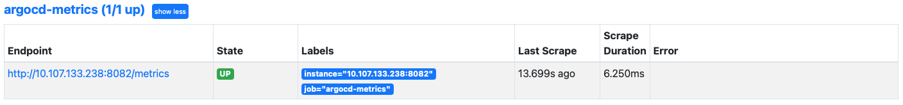
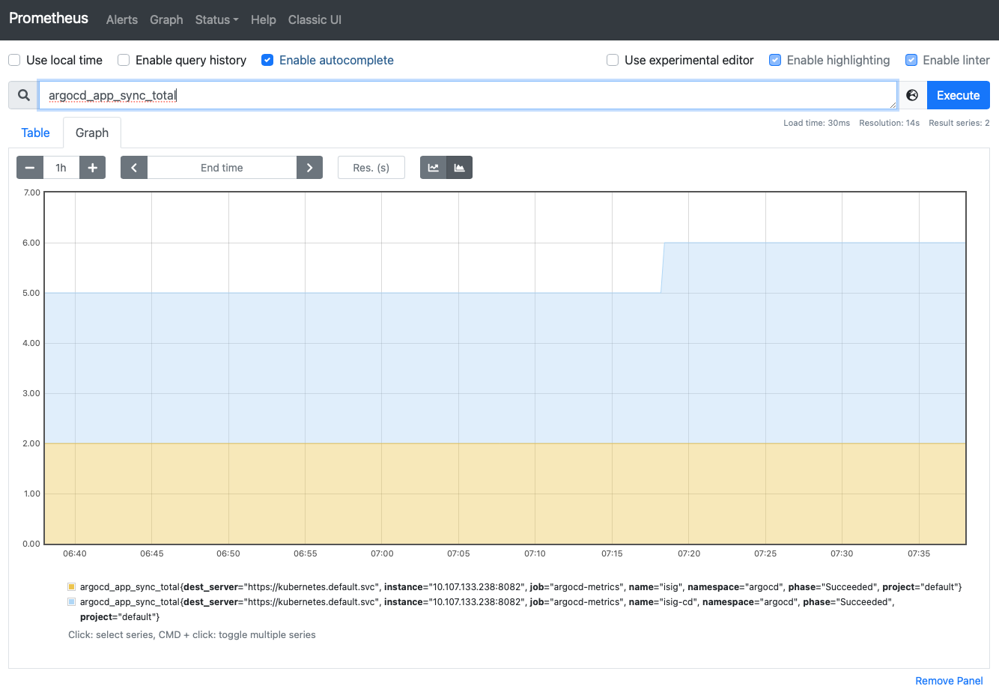
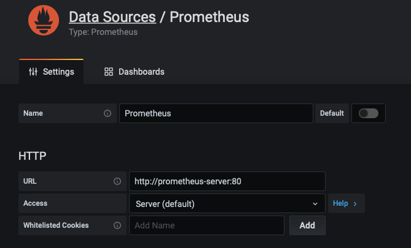
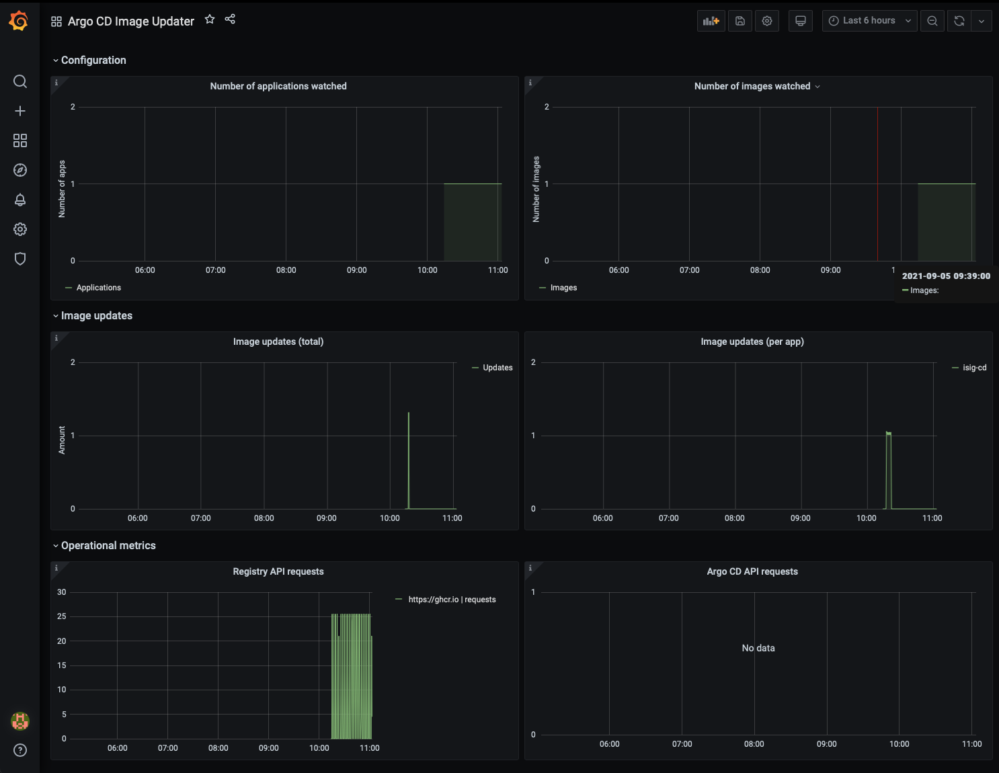

## Overvåkning og metrikker med Prometheus og Grafana

Denne gangen skal vi bruke et såkalt *Helm Chart* til å installere en relativt kompleks applikasjon, [Prometheus](https://prometheus.io).

Først må vi legge til repoet hvor vi finner "kartet". Dernest installerer vi applikasjonen og eksponerer porten den kjører på.

```
helm repo add prometheus-community https://prometheus-community.github.io/helm-charts
helm install prometheus prometheus-community/prometheus
kubectl expose service prometheus-server --type=NodePort --target-port=9090 --name=prometheus-server-np
```

Prometheus klarer av en eller annen grunn ikke løse DNS innenfor klyngen, så når vi nå skal legge til metrikkene til Argo CD må vi gjøre dette på den vanskelige måten. Først må vi finne IP-adressen til Argo CD Metrics tjenesten:

```
get service argocd-metrics -n argocd
```
Du skal nå få noe som dette. `CLUSTER-IP` er den adressen vi er ute etter.

```
NAME             TYPE        CLUSTER-IP       EXTERNAL-IP   PORT(S)    AGE
argocd-metrics   ClusterIP   10.107.133.238   <none>        8082/TCP   14m
```

Vi skal også hente ut data fra *Argo CD Image Updater* da den har sitt eget metrikk-endepunkt. Dette er ikke dog ikke eksponert som en *service*.

```
kubectl get pod -n argocd -o wide | grep image
argocd-image-updater-6f8cc599b4-mttx6   1/1     Running   0          42m   172.17.0.15   minikube   <none>           <none>
```

Nå må vi legge til denne informasjonen i Prometheus-konfigurasjonen.

```
kubectl edit cm prometheus-server -o yaml
```
Finn `data.scrape_configs` og legg denne snutten rett under. Bytt ut IP-adressen med de du faktisk fikk. Du kan like gjerne endre `scrape_interval` med det samme, siden vi ønsker rask tilbakemelding.

```
    - job_name: argocd
      static_configs:
      - targets:
        - 10.107.133.238:8082
    - job_name: argocd-image-updater
      static_configs:
      - targets:
        - 172.17.0.15:8081
```

Kjør følgende kode for å tilgjengeliggjøre tjenesten.

```
export POD_NAME=$(kubectl get pods --namespace default -l "app=prometheus,component=server" -o jsonpath="{.items[0].metadata.name}")
kubectl --namespace default port-forward $POD_NAME 9090 2>&1 >/dev/null &
```

Nan vi åpne [Prometheus > Targets](http://localhost:9090/targets) og kontrollere at vi har tilgang til disse metrikkene. 



Nå som vi har fått litt data kan vi bruke Prometheus sin spørrefunksjon til å tegne et fint diagram over hvor ofte hver enkelt applikasjon vi har installert har blitt synkronisert.



## Installere Grafana

Nå skal vi prøve oss på å visualsere metrikken som *Argo CD Image Updater* eksponerer. Først må vi installere Grafana og eksponere porten tjenesten kjører på.

```
helm repo add grafana https://grafana.github.io/helm-charts
helm install grafana stable/grafana
kubectl expose service grafana --type=NodePort --target-port=3000 --name=grafana-np
```

Dernest må vi som vanlig lage en *port forward* slik at vi kan nå tjenesten fra arbeidsstasjonen.

```
export POD_NAME=$(kubectl get pods --namespace default -l "app.kubernetes.io/name=grafana,app.kubernetes.io/instance=grafana" -o jsonpath="{.items[0].metadata.name}")
kubectl --namespace default port-forward $POD_NAME 3000 2>&1 >/dev/null &
```

Grafana har gjemt passordet sitt som en *secret*.

```
kubectl get secret --namespace default grafana -o jsonpath="{.data.admin-password}" | base64 --decode ; echo
```

Nå kan du åpne Grafana på http://localhost:3000 og logge deg inn med brukernavn "admin" og passordet du hentet ut nettopp.

## Konfigurere Grafana

Det neste som må gjøres er å legge til den Prometheus-instansen vi nettopp har installert som en datakilde. Her trenger vi kun å angi URL som er `http://prometheus-server:80`.



Nå er vi klare til å lage et *dashboard*. Dette gjør vi ved å gå til **+ > Create > Import** og lime inn [denne koden](https://raw.githubusercontent.com/Itema-as/gitops-in-practice/main/grafana-dashboard.json?token=AACSMLX4IATCPOZIHRHBDLLBGSDVK) i **Import via panel json**. Her man man se hvor ofte et en applikasjon er oppdatert i diagrammet *Image updates (per app)*.

